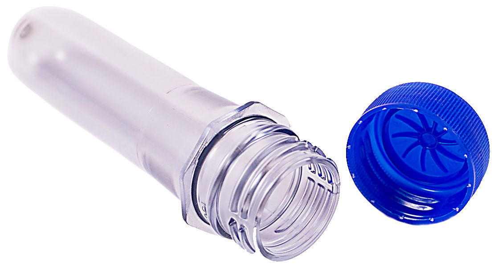

<h1 align="center">PREFORM & CAPS CALCULATOR </h1>
<h6 align="center" style="color: blue; margin-top: -1rem;"><em>Version 0.1.0</em></h6>

  

  

 

<blockquote align="center">
  <em>
   

                      Preform & Caps Calculator is a useful application for calculating the:
                      <li>Total Preform with Caps Quantities</li>
                      <li>Total Kilograms (Kg) Of Preform & Caps</li>
                      <li>Total Carton Of Preform & Caps</li>
                      <li>Total Crates Of Preform & Caps (of 12 Units)</li>
                      <li>Unit &amp; Total Amount</li>
                      of both Preform and Caps needed in production.
                    

  </em>
</blockquote>

 

<h2 align="center">USAGE...</h2>

<h6>
            <ul>
              <li>
                <ins>Optional Fields</ins>:
              </li>
              <ul>
                <li>
                  Only Change The Value In The Optional Field If Your Value For
                  Calculation Is Different From The Default Value
                </li>
              </ul>
            </ul>
          </h6>
          <h6>
            <ul>
              <li>
                <ins>Required Field</ins>:
              </li>
              <ul>
                <li>
                  You Are Required To Enter Either The Total Pieces 
                  To Be Calculated In In The "Total Pieces" Input Field, Then
                  Click On "Calculate Pieces".
                   
                  OR  
                  Enter The Total Kilogram (Kg) To Be Calculated In
                  The "Total Kg" Input Field And Click On "Calculate Kg".
                </li>
              </ul>
            </ul>
          </h6>
          <h6>That's It And You Would See The  Results Rollout</h6>

<h4><ins>UPDATE</ins></h4>
<h6 margin-bottom="-5px"><em>Version: 1.0.0</em></h6>
<ul>
  <li>Implemented Progressive Web App (PWA).</li>
  <li>Implemented Result Persistance To Storage.</li>
</ul>

Use Preform & Caps Calculator @ <b> [Preform & Caps Calculator](https://sidodus.github.io/preform-and-caps-calculator/)</b>

<h6 style="margin: 1em;"><em>A Progressive Web App (PWA) Developed With React.js & Redux State Management</em></h6>

> Preform & Caps Calculator Is Developed By Saheed Odulaja.  
> Feel Free To Fork This Repository.  
> Also Be Kind Enough To Leave A STAR 🌟 As A Mark Of Encouragement 😃.
